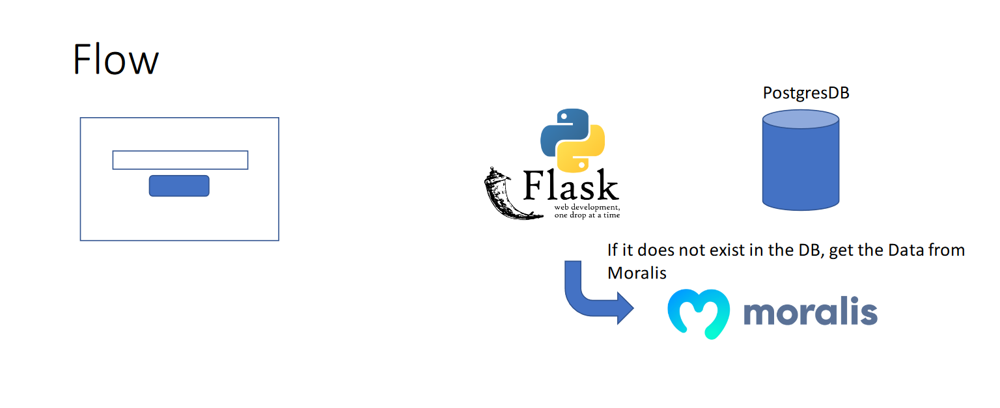

# NFT-Marketplace-Info

All info about NFT Tokens by entering the mint address

--- I N S T A L A T I O N ---

Win+R, type "cmd" and open. Then copy the text "gh repo clone adllkhan/NFT-Marketplace-Info", paste and press enter.
Or you can open it by downloading the ZIP and unpacking it to PycharmProjects path.

--- U S A G E ---

The nft address is written to the input, 
then we check if this nft address is in our database or it is not.
If it is - we send all the data about this nft to the user,
if not - we take information about this nft by moralis API,
add this information to the database and send it to the user.

--- P R I M E R ---

--- E X A M P L E ---

Flow

Database
